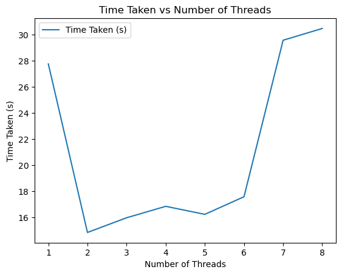

# Multi-Threading

## Submitted By:

- **Name:** Ishaan Gaba  
- **Roll Number:** 102103281  
- **Course:** 3CO10

## Introduction

The project aims to thoroughly assess the impact of multi-threading on the efficiency of matrix multiplication operations. Matrix multiplication is a fundamental mathematical operation widely used in various fields such as mathematics, physics, engineering, and computer science. The performance of matrix multiplication can significantly influence the overall efficiency of computational tasks, especially in applications involving large-scale data processing and numerical simulations.

This project explores how parallelization techniques, specifically multi-threading, can improve the performance of matrix multiplication algorithms. By leveraging Python libraries such as NumPy, threading, and Pandas, the project conducts extensive benchmarking experiments to analyze the effects of multi-threading on computation time and CPU utilization. The findings of this investigation are crucial for understanding the scalability and efficiency of matrix multiplication algorithms in multi-core computing environments.
## Graphs

## Methodology

The benchmarking methodology employed by the project involves several key steps:

1. **Matrix Generation**: Random matrices of varying sizes and quantities are generated using NumPy's random number generation capabilities. These matrices serve as the input data for matrix multiplication experiments.

2. **Benchmarking**: The project conducts benchmarking experiments to evaluate the performance of matrix multiplication algorithms. By varying the number of threads and observing the corresponding changes in execution time, the project assesses the impact of multi-threading on computation speed and efficiency.

3. **Performance Analysis**: The benchmarking results are analyzed to gain insights into the scalability and effectiveness of multi-threading in accelerating matrix multiplication operations. Performance metrics such as execution time, speedup, efficiency, and CPU utilization are computed and evaluated to provide a comprehensive assessment of multi-threaded matrix multiplication algorithms.

## Visualizations

The project utilizes visualizations to present the benchmarking results in a clear and informative manner. Key visualizations include:

1. **Thread vs Time Taken**: A line plot illustrating the relationship between the number of threads and the execution time of matrix multiplication operations. This visualization highlights how multi-threading affects computation speed and efficiency.
   
| Threads | Time Taken (s) |
|---------|----------------|
|    1    |    27.761860   |
|    2    |    14.851453   |
|    3    |    15.976468   |
|    4    |    16.852965   |
|    5    |    16.240497   |
|    6    |    17.587126   |
|    7    |    29.579058   |
|    8    |    30.479495   |

3. **Cores Utilization**: A line plot showing CPU utilization over the course of matrix multiplication experiments. This visualization provides insights into how effectively CPU cores are utilized during multi-threaded computation tasks.

 

